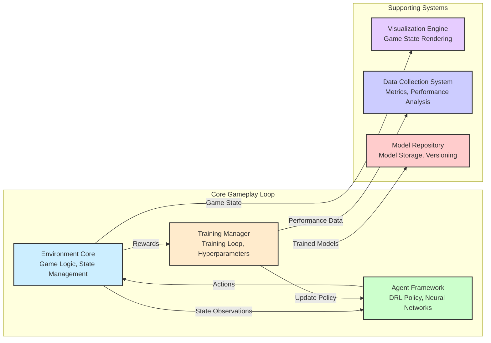
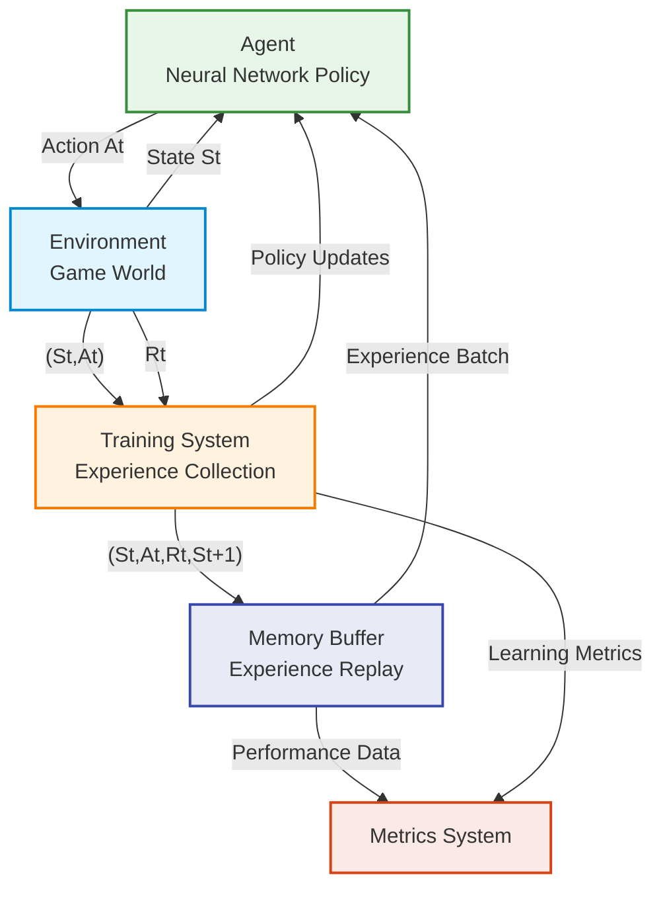
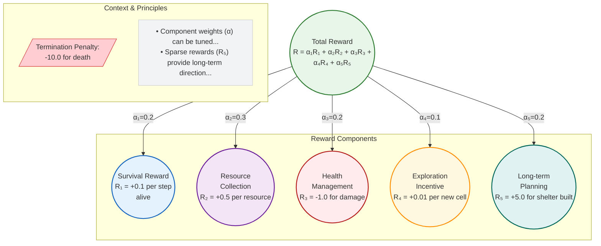
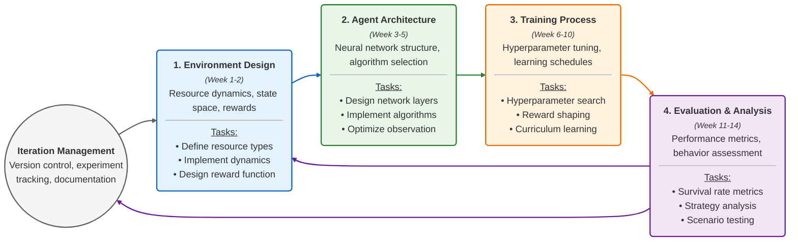
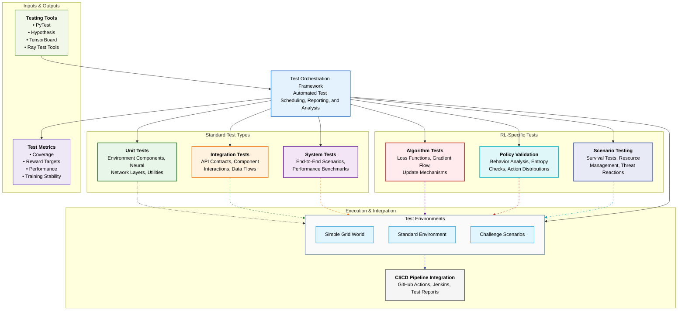

# SIERRA
Survival Intelligence Environment for Resource Research and Adaptation

## Requirements Analysis

### Functional Requirements:

- Grid-based navigation environment with multi-resource management (food, water, materials)
- Dynamic environmental conditions (day/night cycles, weather patterns, seasons)
- Threat and hazard system with avoidance mechanics
- **Crafting mechanics for creating tools, shelter, or other essential items**
- Reinforcement learning agent implementation with observation and action spaces
- Training framework with configurable hyperparameters
- Visualization system for game states and agent performance
- Metrics collection and analysis for learning evaluation
- Save/load functionality for trained models and training sessions

### Non-Functional Requirements:

- Performance: Simulation speed of at least 1000 steps/second for efficient training
- Scalability: Support for parallel training instances
- Reliability: Stable execution for extended training periods (10M+ steps)
- Observability: Comprehensive metrics dashboard and behavior visualization
- Maintainability: Modular code structure with clear separation of concerns

## Architecture Overview

### Component Descriptions

- **Environment Core**: Game logic, state transitions, and reward calculation
- **Agent Framework**: Deep RL implementation with neural network policies
- **Training Manager**: Coordinates training sessions and hyperparameter optimization
- **Visualization Engine**: Renders game state and agent behavior for analysis
- **Data Collection System**: Gathers performance metrics and learning statistics
- **Model Repository**: Stores and versions trained models

### Data Flow Patterns

- Environment → Agent: State observations (resource levels, position, threats)
- Agent → Environment: Actions (movement, resource collection, crafting)
- Environment → Data Collector: Rewards, state transitions, episode statistics
- Training Manager → Agent: Hyperparameter updates and learning rate schedules

## Data Model

- **GameState**: Grid representation, agent position, resource locations, threat positions
- **AgentObservation**: Partial or full state information provided to agent
- **Action**: Discrete or continuous action space (movement, interaction, crafting)
- **Reward**: Multi-component reward signal based on survival metrics
- **TrainingMetadata**: Hyperparameters, episode counts, total steps

## Technology Stack

- **Programming Language**: Python 3.9+
- **RL Frameworks**: PyTorch, Stable Baselines3
- **Environment**: Custom implementation with NumPy/PyGame
- **Data Processing**: NumPy, Pandas
- **Visualization**: Matplotlib, TensorBoard
- **Distributed Training**: Ray
- **Containerization**: Docker

## Implementation Roadmap

The development will follow an iterative process, visualized below. The following sequential milestones represent the primary focus within these iterative development cycles.

1. Basic environment with single resource type (2 weeks)
2. Multi-resource management system (2 weeks)
3. Dynamic environmental conditions (2 weeks)
4. Basic RL agent integration (1 week)
5. Advanced agent architectures (PPO, SAC, etc.) (3 weeks)
6. Visualization and analysis tools (2 weeks)
7. Performance optimization (2 weeks)

## Integration Testing Framework

### Testing Components

- Environment consistency tests
- Agent interface compatibility tests
- Training stability tests
- Performance benchmarks for various algorithms
- Reward signal validation

## RL Algorithm Comparison

Comparative experiments were conducted to evaluate the performance of PPO and DQN algorithms on the SIERRA environment. The key evaluation metrics are summarized below:

*   **PPO Model:**
    *   Mean Episode Reward: -21.28 +/- 2.91
    *   Mean Episode Length: 946.83
*   **DQN Model:**
    *   Mean Episode Reward: -42.81 +/- 11.10
    *   Mean Episode Length: 949.49

**Interpretation:**

The PPO model demonstrated significantly better performance compared to the DQN model, achieving a higher mean episode reward and a lower standard deviation, indicating more stable and successful learning. The mean episode lengths were comparable for both algorithms.

It's worth noting that the SAC algorithm was also considered but was found to be incompatible with the current discrete action space of the SIERRA environment.

## User Interface Framework

### Component Specifications

- Training configuration interface
- Real-time visualization of agent behavior
- Performance metrics dashboard
- Learning curve visualization
- Model comparison tools

## System Monitoring and Observability

- Episode return tracking
- Resource management efficiency metrics
- Survival duration statistics
- Environment exploration coverage
- Policy entropy and value loss monitoring

## Infrastructure Requirements

### Infrastructure Sizing

- Development: 8+ CPU cores, 16GB+ RAM, NVIDIA GPU (4GB+ VRAM)
- Training: Cloud GPU instance or local workstation with RTX series GPU
- Storage: 50GB for code, models, and training data

### Cost Estimation (Monthly)

- Local development: Hardware depreciation + electricity (~$30/month)
- Cloud GPU training (optional): $100-300/month depending on instance type and usage

## Documentation Strategy

- Code documentation with docstrings
- README and setup instructions
- Training configuration guides
- Experiment results analysis
- Model performance comparisons
